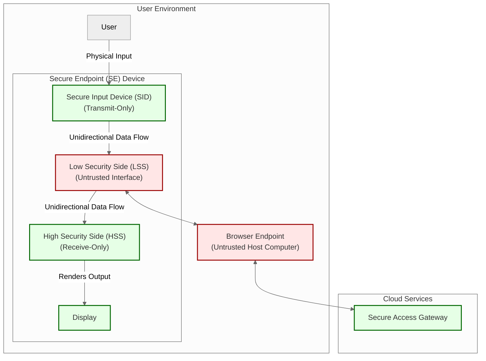
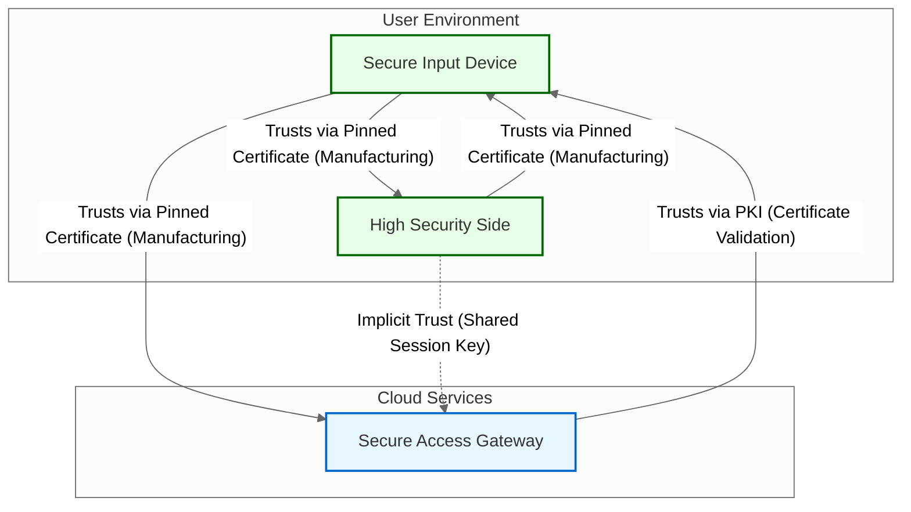
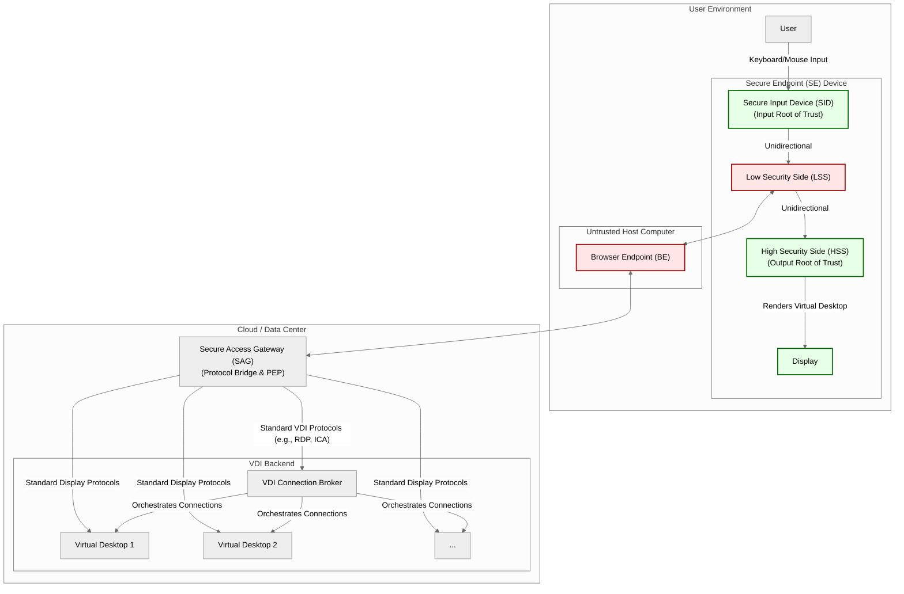
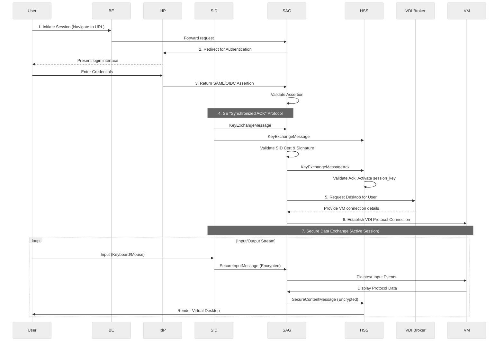

# The Secure Endpoint System: A Hardware Enforced Architecture for Secure Sessions

## An Introduction to a New Security Architecture

### The Problem: The Untrusted Endpoint

Modern enterprise security is predicated on a fundamental conflict: organizations must provide users with access to sensitive data and applications, but they cannot guarantee the security of the user's endpoint computer. The proliferation of remote work, BYOD policies, and sophisticated endpoint-targeting malware has rendered the traditional security perimeter obsolete. The core problem is that if the host environment—including the operating system, the I/O stack, or the web browser—is compromised, any software-based security solution running within that environment is also implicitly compromised.

### Existing Solutions and Their Limitations

Several categories of technology have been developed to mitigate the risk of the untrusted endpoint. These solutions, which include **Virtual Desktop Infrastructure (VDI)**, **Remote Browser Isolation (RBI)**, **Secure Access Service Edge (SASE)**, **hardware-based trusted execution environments (e.g., Intel SGX)**, and **Endpoint Detection and Response (EDR)**, attempt to create an isolated, secure workspace or to detect and react to threats on the endpoint.

However, these technologies share a critical, foundational flaw: they all ultimately depend on the integrity of the host's software stack for processing input and output. They run as software clients on a general-purpose, bidirectional hardware platform. An attacker can compromise this software stack at multiple levels:

- **Browser-Level Compromise (Man-in-the-Browser):** An attacker can inject malicious code or extensions into the web browser. This allows them to intercept user input directly from web forms and capture rendered plaintext data by scraping the browser's display buffer.
- **OS-Level Compromise:** A more sophisticated attacker can compromise the host operating system at a deep level (e.g., a kernel-level rootkit). This allows them to position malware to intercept data from the I/O stack, capturing all user input via key loggers and all visual output via screen scraping.

In both scenarios, the cryptographic protections of the secure session are bypassed because the malware operates on the plaintext data _before_ it is encrypted for transmission or _after_ it has been decrypted for display.

### The Secure Endpoint Solution

The Secure Endpoint (SE) system is a hardware-enforced architecture designed to solve this problem by verifiably decoupling user session security from the host computer's security posture. The system's core thesis is that true session integrity can only be guaranteed by physically and cryptographically separating the trusted I/O path from the untrusted host.

The SE architecture achieves this separation through two primary, interconnected innovations:

1. **Hardware-Enforced I/O Segregation:** The system's foundational security guarantee is derived from physically unidirectional hardware. A **transmit-only Secure Input Device (SID)** captures and encrypts user input, while a **receive-only High Security Side (HSS)** decrypts and renders all system output. This hardwired architecture eliminates the physical pathways required for malware to intercept plaintext I/O.
2. **Three-Node Cryptographic Trust Model:** This hardware model is made viable for interactive sessions by a cryptographic protocol that establishes a synchronized session state across three trusted nodes—the SID, the HSS, and a **Secure Access Gateway (SAG)**—functionally bypassing the untrusted host. The "Synchronized ACK" protocol creates two distinct, unidirectional encrypted channels (SID-to-SAG for input, SAG-to-HSS for output), ensuring the host computer and its browser function only as relays for opaque, encrypted data.

The synthesis of these principles—physically segregated I/O and a three-party cryptographic session—constitutes the core of the Secure Endpoint system. The resulting architecture ensures the integrity and confidentiality of the user session are demonstrably independent of the host computer's security.

## System Components and Their Roles

The Secure Endpoint system combines cloud-native services and user-environment hardware, each with specific security-critical functions. These integrated components work together to establish and maintain secure user sessions.

### Cloud-Native Components

**Secure Access Gateway (SAG):** This cloud-native policy enforcement point manages communications with upstream services on behalf of the user. It participates in the “Synchronized ACK” protocol to establish a shared `session_key` and transmits encrypted SecureContentMessage to the HSS.

**Identity Provider (IdP):** An external, federated service that authenticates user identities. Its integration with the SAG provides seamless verification of user credentials and establishes initial user trust.

**Key Management Service (KMS):** This service functions as the system’s Public Key Infrastructure (PKI), which includes a Certificate Authority (CA). Its primary role is to issue device identity certificates and manage their lifecycle. When a device initiates a session, the SAG validates the SID’s certificate against this infrastructure. This validation process must include a mandatory and successful certificate revocation check (via CRL or OCSP) to ensure the device has not been compromised, lost, or stolen.

### User Environment Components

The user environment contains the hardware and software that the user directly interacts with. It is composed of two primary elements: the untrusted Browser Endpoint (BE) on the user's computer and the Secure Endpoint (SE) device.

**Browser Endpoint (BE):** The BE is the web browser on the user's untrusted host computer. It functions as an intermediary, relaying messages between the Secure Access Gateway (SAG) and the SE device. The BE is considered untrusted and has no access to plaintext sensitive data.

**Secure Endpoint (SE):** This hardware device enforces the system’s core security principles. It is a composite device that isolates cryptographic functions and user I/O from the untrusted host computer. It consists of the following interconnected components:

- **Low Security Side (LSS):** This component is the SE's untrusted network interface. It routes two distinct data streams: it forwards the data stream received from the Browser Endpoint (BE) to the High Security Side (HSS), and it forwards the data stream received from the Secure Input Device (SID) to the BE.

- **Secure Input Device (SID):** This component functions as the session's root of trust. It captures user input (e.g., keyboard, mouse), initiates the key exchange protocol, and transmits data to the Low Security Side (LSS) over a transmit-only unidirectional bridge.

- **High Security Side (HSS):** A security-hardened, receive-only core that performs cryptographic operations related to session synchronization and content decryption. It receives an inbound-only data stream from the LSS, decrypts and authenticates messages, and renders the secure visual output to a display.

## Core Hardware Design Principles and Security Hardening

The physical design of the SE’s trusted components forms the foundation of its security posture. These hardware-level principles are implemented to protect against sophisticated attacks.

- **Physically Enforced Unidirectional:** Data flow from the untrusted host (BE/LSS) to the HSS is strictly one-way, enforced by a dedicated, tamper-resistant unidirectional fiber-optic bridge. This architecture prevents reverse channels that could be exploited for command-and-control operations or exfiltrating data.
- **Electrical Isolation:** All trusted components (SID, HSS) use independent power supplies and have no common electrical ground with the untrusted side. This design prevents side-channel attacks that could exploit power analysis.
- **Clock Independence:** The SID and HSS operate with separate, asynchronous clock sources to prevent timing-based side-channel attacks that might extract information about cryptographic operations from subtle timing variations.
- **Secure Hardware Elements and Cryptographic Processing:** Both the SID and HSS must incorporate a Trusted Platform Module (TPM 2.0) to provide a hardware root of trust. The static private keys for these components are generated by, stored within, and never leave the TPM. All cryptographic operations involving these keys are performed within the TPM’s secure boundary.
- **Secure Boot and Runtime Security:** The HSS must implement a secure boot process anchored in a hardware root of trust to guarantee firmware integrity. All processes must run in a sandbox environment with minimum necessary privileges, and the memory layout is randomized at each boot using Address Space Layout Randomization (ASLR).
- **Data Stream and Message Processing (HSS):** The HSS is responsible for decrypting and rendering the `SecureContentMessage` it receives from the SAG. It generates the complete, secure visual output and a dedicated status view on its display to provide unambiguous feedback to the user.
- **Resilient Error Handling:** The HSS is designed to be resilient against transient errors or attacks from untrusted sources. A single protocol anomaly, such as a timeout waiting for a `KeyExchangeMessageAck` or receipt of an invalid one, will not cause a terminal failure. Instead, the HSS will enter a "Limited Operation" failure state. In this mode, it immediately ceases processing all `SecureContentMessage` messages and is only capable of processing a new `KeyExchangeMessage` to re-establish a secure session. It must provide an unambiguous visual warning on its display, such as: "SECURITY DEGRADED: Awaiting re-synchronization." A hard lockdown, requiring a power cycle, is only triggered after a configurable threshold of consecutive failed synchronization attempts.

## Security Posture and Countermeasures

The SE system’s architecture is engineered to counteract a range of sophisticated cyber threats:

- **Remote Code Execution (RCE):** The physically enforced one-way link blocks data exfiltration and prevents attackers on the BE from receiving responses from the trusted components. The BE can still originate traffic toward the HSS over the permitted inbound path, so the SAG and HSS must continue to authenticate and validate every inbound message to suppress command-injection attempts.
- **Session Replay Attacks:** These attacks are countered by a cryptographically enforced monotonic sequencing mechanism in all protocol messages, ensuring that old messages cannot be replayed to deceive the system.
- **State Synchronization Attacks:** These are prevented by the “Synchronized ACK” protocol, which guarantees that all trusted components maintain a consistent and identical `session_key`.
- **Message Forgery:** The authenticity of messages displayed on the HSS display is cryptographically assured. All `SecureContentMessage` and `SecureInputMessage` messages are authenticated using an AEAD scheme (AES-GCM). Any tampering with a message during transit will cause the cryptographic authentication check to fail. The HSS will discard any such message and handle the event according to the `Resilient Error Handling` protocol, providing visual feedback of the anomaly without entering an immediate lockdown.

## Cryptographic & Protocol Design

### Core Protocol Principles

The system’s security is established through a protocol designed to create a synchronized, secure session across the three trusted nodes (SID, HSS, SAG) via an untrusted transport layer.

- **Root of Trust:** The SID is the definitive root of trust for the session, using a hardware-protected static private key to authenticate all protocol messages it generates.
- **Secure Key Distribution with Forward Secrecy:** The protocol uses a non-interactive, static-ephemeral Elliptic Curve Diffie-Hellman (ECDHE) key exchange to establish shared `session_key`. This ensures that the compromise of a long-term static key does not compromise the confidentiality of past sessions.
- **Mutual Trust & State Synchronization:** The “Synchronized ACK” protocol functions as a three-way handshake to ensure all trusted nodes are using the identical `session_key`. The authenticity of messages from the SID is verified via a digital signature, while the acknowledgment from the SAG is verified via a MAC, establishing mutual proof of key possession.
- **Limited Key Lifetime and Nonce Uniqueness:** To mitigate the impact of a potential key compromise, the protocol mandates strict limits on key usage.
  - **Key Rotation:** The `session_key` must be rotated (re-keyed) periodically based on a fixed time interval (e.g., every 15 minutes) or a message-count threshold (e.g., after 2^20 messages), whichever occurs first. This practice limits the temporal scope of any single key.
  - **Nonce Management:** To prevent catastrophic key reuse with the AES-GCM algorithm, a unique nonce must be used for every encryption operation under a given `session_key`. This is achieved by deriving nonces from a strictly monotonic message sequence counter.

### Algorithm Choices and Parameters

This section specifies the cryptographic algorithms and parameters used throughout the protocol. These choices are based on industry-standard, well-vetted primitives to ensure a high level of security.

- **Asymmetric Cryptography:** The system uses Elliptic Curve Cryptography (ECC) with the **NIST P-384** curve for all public key operations.

  - **Digital Signatures:** The **ECDSA** (Elliptic Curve Digital Signature Algorithm) is used to provide authentication and prove message integrity. For example, the SID signs the `KeyExchangeMessage` to authenticate the origin of the key exchange.
  - **Key Agreement:** The **ECDH** (Elliptic Curve Diffie-Hellman) protocol is used to securely establish shared secrets over an untrusted channel, forming the basis of the key exchange.

- **Hash Function:** **SHA-384** is used for all hashing operations. Its output size is compatible with the security level of the P-384 curve.

- **Key Derivation Function (KDF):** The system uses **HKDF-SHA-384** to transform the raw shared secrets from ECDH into cryptographically strong, unique symmetric keys.

  - **Context Binding:** To prevent key misuse and defend against attacks like the Unknown Key-Share (UKS), the KDF `info` parameter includes a domain separation string (`"se-wrap-hss"` or `"se-wrap-sag"`) and the public keys and sequence numbers involved in the exchange. This ensures a key derived for one context cannot be used in another.

- **Message Authentication Code (MAC):** The system uses **HMAC-SHA-384** to generate message authenticators, such as in the `KeyExchangeMessageAck`.

- **Authenticated Encryption:** All symmetric encryption uses **AES-256-GCM** (Advanced Encryption Standard in Galois/Counter Mode).

  - **AEAD:** As an Authenticated Encryption with Associated Data (AEAD) scheme, it provides confidentiality, integrity, and authenticity simultaneously.
  - **Payload Structure:** All encrypted payloads within this protocol are transmitted as a single binary field structured as a concatenation of the `nonce` (12 bytes), the `ciphertext` (variable length), and the `authentication_tag` (16 bytes).
  - **Associated Data (AAD):** Unencrypted message headers (like sequence numbers) are included as AAD. This protects them from tampering, as any modification to the AAD will cause the final authentication check to fail.

- **Random Number Generation:** All cryptographic randomness (for ephemeral keys, nonces, etc.) must be generated by a FIPS 140-3 validated Deterministic Random Bit Generator (**DRBG**) or an equivalent Cryptographically Secure Pseudorandom Number Generator (CSPRNG). This is critical for the unpredictability of single-use keys and nonces.

### Cryptographic Certificates and Key Pairs

The system’s integrity is based on three long-term, static identity certificates, each containing a NIST P-384 Elliptic Curve Cryptography (ECC) public key. The private keys corresponding to the SE device certificates are protected by the hardware's integrated Trusted Platform Modules (TPMs).

#### SID Identity Certificate

The SID's certificate (`SID_Certificate`) establishes its identity and authenticates the messages it originates.

- **Issuance:** The certificate is generated and signed by a secure, offline **Manufacturing CA** at the time of the device's creation.
- **Content:** It contains the SID's public signing key (`sid_static_pub`), which corresponds to a private key that is generated by and never leaves the SID's TPM. The certificate's subject or a custom extension field **must** include the following signed metadata:
  - `device_serial_number`
  - `hardware_revision`
  - `manufacturing_date`
- **Usage:** The SAG validates this certificate to authenticate the device. The HSS uses a pinned copy of this certificate to verify signatures on `KeyExchangeMessage`s.

#### SAG Identity Certificate

The SAG's certificate (`SAG_Certificate`) establishes the identity of the cloud service endpoint.

- **Issuance:** The certificate is generated at the time of the organization's SAG deployment and is signed by a trusted public or private Certificate Authority.
- **Content:** It contains the SAG's public key (`sag_static_pub`), which can be used for both signing and key agreement. The corresponding private key is protected by a cloud Hardware Security Module (HSM).
- **Usage:** The SID and HSS use a pinned copy of this certificate as the definitive trust anchor for the SAG. The SID uses the public key from this certificate to perform the ECDHE key exchange.

#### HSS Identity Certificate

The HSS's certificate (`HSS_Certificate`) establishes its identity for the purpose of secure key agreement.

- **Issuance:** The certificate is generated and signed by the same secure, offline **Manufacturing CA** as the SID certificate.
- **Content:** It contains the HSS's public key agreement key (`hss_static_pub`), which corresponds to a private key that is generated by and never leaves the HSS's TPM. It **must** contain the same `device_serial_number`, `hardware_revision`, and `manufacturing_date` as the corresponding SID certificate.
- **Usage:** The SID uses a pinned copy of this certificate to securely deliver the `session_key` to the HSS.

### The Trust Model

The system’s security is founded on a set of explicit, non-transitive trust relationships established through cryptographic mechanisms. Each trusted component validates messages from other components based on a pre-established basis of trust.

- **SID trusts SAG:** This trust is established at manufacturing by pinning the organization-specific `SAG_Certificate` in the SID's secure storage. The SID uses the public key from this certificate to compute the shared secret required to encrypt the `session_key` for the SAG.
- **SID trusts HSS:** This trust is established at manufacturing by pinning the `HSS_Certificate` into the SID's secure storage. This allows the SID to perform the ECDHE key exchange to securely provide the `session_key` to the HSS.
- **SAG trusts SID:** This trust is established through a standard Public Key Infrastructure (PKI) model. The SAG validates the `SID_Certificate` against a trusted Manufacturing CA and performs a mandatory revocation check. This allows the SAG to verify the SID's signature on a `KeyExchangeMessage` and to log the device's metadata (e.g., serial number).
- **HSS trusts SID:** This trust is established at manufacturing by pinning the `SID_Certificate` into the HSS's secure storage. This allows the HSS to verify the SID's signature on a `KeyExchangeMessage` without reliance on an external PKI.
- **HSS trusts SAG:** This is an implicit trust based on shared state. The HSS trusts messages from the SAG because they are authenticated using a `session_key` that the HSS has verified was established securely between a trusted SID and a trusted SAG. This trust is bootstrapped by the pinning of the `SAG_Certificate` at manufacturing.

### Protocol Messages

The following messages are integral to facilitating secure communication within the Secure Endpoint system:

#### KeyExchangeMessage

The `KeyExchangeMessage` is a protocol message generated by the SID to initiate a session key exchange. It securely distributes a new `session_key` to both the HSS and the SAG. This message provides cryptographic proof of key establishment and ensures all trusted nodes receive the identical session key.

**Message Structure:**

- `session_key_sequence_number`:
  A strictly monotonic integer that uniquely identifies the session key being established. This field prevents replay attacks and ensures message uniqueness.
- `sid_eph_pub`:
  The SID's ephemeral public key for this key exchange. Recipients use this key to derive the shared secret for symmetric encryption.
- `encrypted_payload_hss`:
  The new `session_key`, encrypted for the HSS using AES-256-GCM. The encryption key is derived from an ECDHE shared secret between the SID and HSS. The `session_key_sequence_number` and `sid_eph_pub` are included as Associated Data (AAD) to bind the ciphertext to the specific key exchange context.
- `encrypted_payload_sag`:
  The new `session_key`, encrypted for the SAG using AES-256-GCM. The encryption key is derived from an ECDHE shared secret between the SID and SAG. The `session_key_sequence_number` and `sid_eph_pub` are included as AAD.
- `signature`:
  An ECDSA signature computed over the concatenation of `session_key_sequence_number`, `sid_eph_pub`, `encrypted_payload_hss`, and `encrypted_payload_sag`. This authenticates the message and proves its integrity.

**Transmission:**
The `KeyExchangeMessage` is transmitted over untrusted channels to both the HSS and SAG. Its confidentiality, integrity, and authenticity are assured by the combination of authenticated encryption and digital signature. Recipients must verify the signature and successfully decrypt their respective payloads before accepting the new session key.

**Field Summary:**

| Field                       | Type    | Description                                                                 |
| --------------------------- | ------- | --------------------------------------------------------------------------- |
| session_key_sequence_number | Integer | Monotonic sequence number of the established session key                    |
| sid_eph_pub                 | ECC     | SID's ephemeral public key for ECDHE                                        |
| encrypted_payload_hss       | Binary  | `session_key` encrypted for HSS (AES-256-GCM, ECDHE-derived key, AAD bound) |
| encrypted_payload_sag       | Binary  | `session_key` encrypted for SAG (AES-256-GCM, ECDHE-derived key, AAD bound) |
| signature                   | ECDSA   | Signature over the entire payload using SID's static private key            |

#### KeyExchangeMessageAck

The `KeyExchangeMessageAck` is a protocol message sent by the SAG to the HSS to confirm successful adoption of a new `session_key`. This message provides cryptographic proof that the SAG possesses the correct `session_key` corresponding to a specific `session_key_sequence_number`.

**Message Structure:**

- `session_key_sequence_number`:
  The sequence number of the session key being acknowledged. This value must match the sequence number from the corresponding `KeyExchangeMessage`.
- `authenticator`:
  A Message Authentication Code (MAC) computed over the `session_key_sequence_number`. The key for the MAC is derived from the newly adopted `session_key` using HKDF, ensuring that only an entity possessing the correct `session_key` can generate a valid authenticator.

**Transmission:**
The `KeyExchangeMessageAck` is transmitted in plaintext. Its purpose is not confidentiality but authentication. The HSS validates the message by re-deriving the MAC key from its pending `session_key` and verifying that the computed MAC matches the `authenticator` field.

**Field Summary:**

| Field                       | Type    | Description                                                                  |
| --------------------------- | ------- | ---------------------------------------------------------------------------- |
| session_key_sequence_number | Integer | The sequence number of the acknowledged session key                          |
| authenticator               | Binary  | A MAC over the sequence number, derived from the corresponding `session_key` |

#### SecureContentMessage

The `SecureContentMessage` is a protocol message used to transmit application data securely from the SAG to the HSS after a session is established. It is always encrypted and authenticated using the current active `session_key`.

**Message Structure:**

- `sag_sequence_number`:
  A strictly monotonic integer that uniquely identifies each message sent from the SAG within the session. This field prevents replay attacks and ensures message ordering.
- `content_type`:
  A label indicating the purpose of the message (e.g., application data, transaction challenge).
- `encrypted_payload`:
  The AEAD-encrypted payload. The header fields (`sag_sequence_number`, `content_type`) are included as AAD during the AES-256-GCM encryption to bind the ciphertext to its context.

**Transmission:**
The `SecureContentMessage` is transmitted over untrusted channels. Its confidentiality, integrity, and authenticity are assured by the AEAD scheme. The HSS must process the `encrypted_payload` to extract the nonce, then verify the authentication tag and decrypt the ciphertext before processing the message.

**Field Summary:**

| Field               | Type    | Description                              |
| ------------------- | ------- | ---------------------------------------- |
| sag_sequence_number | Integer | Monotonic sequence number of the message |
| content_type        | Enum    | Label indicating message purpose         |
| encrypted_payload   | Binary  | The AEAD-encrypted payload               |

#### SecureInputMessage

The `SecureInputMessage` is a protocol message used to transmit user input securely from the SID to the SAG after a session is established. It is always encrypted and authenticated using the current active `session_key`.

**Message Structure:**

- `sid_sequence_number`:
  A strictly monotonic integer that uniquely identifies each message sent from the SID within the session. This field prevents replay attacks and ensures message ordering.
- `encrypted_payload`:
  The AEAD-encrypted user input payload. The `sid_sequence_number` is included as AAD during the AES-256-GCM encryption to bind the ciphertext to its context.

**Transmission:**
The `SecureInputMessage` is transmitted over untrusted channels. Its confidentiality, integrity, and authenticity are assured by the AEAD scheme. The SAG must process the `encrypted_payload` to extract the nonce, then verify the authentication tag and decrypt the ciphertext before processing the user input.

**Field Summary:**

| Field               | Type    | Description                   |
| ------------------- | ------- | ----------------------------- |
| sid_sequence_number | Integer | Monotonic sequence number     |
| encrypted_payload   | Binary  | The AEAD-encrypted user input |

## Protocol Specifications

### Session Key Exchange and Synchronization

The “Synchronized ACK” protocol establishes a shared `session_key` across the SID, HSS, and SAG. It uses a static-ephemeral ECDHE key exchange to provide forward secrecy and guarantees that all nodes are synchronized to the same key before it is used for secure content transmission.

1. **Key Generation (SID):** The SID initiates the exchange by generating a new symmetric `session_key` and incrementing the `session_key_sequence_number`.

2. **Ephemeral Key Exchange Setup (SID):** The SID prepares for the key exchange.

   - It generates a new, single-use ephemeral ECDH key pair (`sid_eph_priv`, `sid_eph_pub`).
   - It computes two distinct shared secrets using its ephemeral private key and the static public keys of the HSS and SAG:
     - `shared_secret_hss = ECDH(sid_eph_priv, hss_static_pub)`
     - `shared_secret_sag = ECDH(sid_eph_priv, sag_static_pub)`
   - It derives a unique symmetric wrapping key from each shared secret using HKDF-SHA-384:
     - `wrap_hss = HKDF(shared_secret_hss, salt=0, info="se-wrap-hss" || sid_static_pub || hss_static_pub || sid_eph_pub || session_key_sequence_number)`
     - `wrap_sag = HKDF(shared_secret_sag, salt=0, info="se-wrap-sag" || sid_static_pub || sag_static_pub || sid_eph_pub || session_key_sequence_number)`
   - It constructs the Associated Data (AAD) required for the authenticated encryption. To defend against replay and context-confusion attacks, the AAD for each recipient binds the ciphertext to the key exchange context by including the `session_key_sequence_number` and the `sid_eph_pub`.
     - `aad_hss = session_key_sequence_number || sid_eph_pub`
     - `aad_sag = session_key_sequence_number || sid_eph_pub`
   - It encrypts the `session_key` separately for each recipient using the derived wrapping keys and the context-specific AAD:
     - `encrypted_payload_hss = AES-256-GCM_encrypt(wrap_hss, session_key, nonce_hss, aad_hss)`
     - `encrypted_payload_sag = AES-256-GCM_encrypt(wrap_sag, session_key, nonce_sag, aad_sag)`
   - The SID securely zeros and discards `sid_eph_priv` immediately after use to ensure forward secrecy.

3. **Message Creation and Signing (SID):** The SID constructs and signs the `KeyExchangeMessage` to ensure its authenticity and integrity.

   - It constructs the message body by concatenating the fields generated in the previous step:
     - `message_body = session_key_sequence_number || sid_eph_pub || encrypted_payload_hss || encrypted_payload_sag`
   - It computes an ECDSA signature over the SHA-384 hash of the message body using its hardware-protected static private key (`sid_static_priv`):
     - `signature = ECDSA_sign(sid_static_priv, SHA-384(message_body))`
   - The final `KeyExchangeMessage` is formed by appending the signature to the message body:
     - `KeyExchangeMessage = message_body || signature`

4. **Key Distribution (SID):** The SID simultaneously transmits the `KeyExchangeMessage` to two destinations: directly to the HSS via the unidirectional fiber-optic bridge, and to the SAG via the untrusted Browser Endpoint.

5. **State Transition (HSS):** Upon receiving the `KeyExchangeMessage`, the HSS performs the following sequence of operations to validate the message and recover the `session_key`.

   - It parses the message into its constituent parts:
     - `KeyExchangeMessage = message_body || signature`
   - It verifies the signature using the SID's pinned static public key (`sid_static_pub`):
     - `is_valid = ECDSA_verify(sid_static_pub, SHA-384(message_body), signature)`
     - If `is_valid` is false, the message is discarded.
   - It parses the `message_body` to extract the protocol fields:
     - `message_body = session_key_sequence_number || sid_eph_pub || encrypted_payload_hss || encrypted_payload_sag`
   - It performs a stateful anti-replay check, verifying that the `session_key_sequence_number` is strictly greater than the last sequence number processed from this SID. If not, the message is discarded.
   - It computes the shared secret using its static private key (`hss_static_priv`) and the SID's ephemeral public key from the message:
     - `shared_secret_hss = ECDH(hss_static_priv, sid_eph_pub)`
   - It derives the context-specific wrapping key using the same HKDF parameters as the SID:
     - `wrap_hss = HKDF(shared_secret_hss, salt=0, info="se-wrap-hss" || sid_static_pub || hss_static_pub || sid_eph_pub || session_key_sequence_number)`
   - It reconstructs the Associated Data (AAD) for decryption:
     - `aad_hss = session_key_sequence_number || sid_eph_pub`
   - It performs an authenticated decryption of its payload to recover the `session_key`:
     - `session_key = AES-256-GCM_decrypt(wrap_hss, encrypted_payload_hss, aad_hss)`
     - If decryption fails, the message is discarded.
   - It transitions the recovered `session_key` and `session_key_sequence_number` to a "pending" state and starts a `SessionKeyGraceDuration` timer, awaiting the `KeyExchangeMessageAck` from the SAG.

6. **State Transition (SAG):** The SAG processes the `KeyExchangeMessage`.

   - It parses the message into its constituent parts:
     - `KeyExchangeMessage = message_body || signature`
   - It validates the SID's X.509 certificate (`SID_Certificate`) against a trusted Manufacturing CA, including a mandatory and successful revocation check (CRL or OCSP). If validation fails, the message is discarded.
   - It verifies the signature using the SID's public key from the validated certificate (`sid_static_pub`):
     - `is_valid = ECDSA_verify(sid_static_pub, SHA-384(message_body), signature)`
     - If `is_valid` is false, the message is discarded.
   - It parses the `message_body` to extract the protocol fields:
     - `message_body = session_key_sequence_number || sid_eph_pub || encrypted_payload_hss || encrypted_payload_sag`
   - It performs a stateful anti-replay check, verifying that the `session_key_sequence_number` is strictly greater than the last sequence number processed from this SID. If not, the message is discarded.
   - It computes the shared secret using its static private key (`sag_static_priv`) and the SID's ephemeral public key from the message:
     - `shared_secret_sag = ECDH(sag_static_priv, sid_eph_pub)`
   - It derives the context-specific wrapping key using the same HKDF parameters as the SID:
     - `wrap_sag = HKDF(shared_secret_sag, salt=0, info="se-wrap-sag" || sid_static_pub || sag_static_pub || sid_eph_pub || session_key_sequence_number)`
   - It reconstructs the Associated Data (AAD) for decryption:
     - `aad_sag = session_key_sequence_number || sid_eph_pub`
   - It performs an authenticated decryption of its payload to recover the `session_key`:
     - `session_key = AES-256-GCM_decrypt(wrap_sag, encrypted_payload_sag, aad_sag)`
     - If decryption fails, the message is discarded.
   - Upon successful recovery, the SAG immediately adopts the new `session_key` and `session_key_sequence_number` as active for this session.

7. **The Synchronized Acknowledgment (SAG):** The SAG confirms its state transition by constructing and sending a `KeyExchangeMessageAck`.

   - It derives an authentication key from the newly adopted `session_key` using HKDF. This key is context-specific to the sequence number being acknowledged:
     - `auth_key = HKDF(session_key, salt=0, info="se-ack-key" || session_key_sequence_number)`
   - It computes an HMAC-SHA-384 authenticator over the `session_key_sequence_number` using the derived `auth_key`:
     - `authenticator = HMAC-SHA-384(auth_key, session_key_sequence_number)`
   - It constructs the `KeyExchangeMessageAck` by concatenating the sequence number and the authenticator:
     - `KeyExchangeMessageAck = session_key_sequence_number || authenticator`
   - The resulting message is sent to the HSS via the untrusted Browser Endpoint.

8. **Final State Synchronization (HSS):** The HSS finalizes the key exchange upon receipt of the `KeyExchangeMessageAck`.

   - It parses the message to extract its components:
     - `KeyExchangeMessageAck = received_sequence_number || received_authenticator`
   - It verifies that the `received_sequence_number` is identical to the `session_key_sequence_number` currently in the "pending" state. If they do not match, the message is discarded, and the HSS awaits either a valid `KeyExchangeMessageAck` or the expiration of the `SessionKeyGraceDuration` timer.
   - It derives the authentication key from its pending `session_key` using the same context-specific HKDF derivation as the SAG:
     - `auth_key = HKDF(pending_session_key, salt=0, info="se-ack-key" || pending_session_key_sequence_number)`
   - It computes the expected authenticator for verification:
     - `expected_authenticator = HMAC-SHA-384(auth_key, pending_session_key_sequence_number)`
   - It performs a constant-time comparison between `expected_authenticator` and `received_authenticator`.
   - **On Success:** If the authenticators match, this provides cryptographic proof that the SAG possesses the correct `session_key`. The HSS performs the following actions:
     1. It promotes the pending `session_key` and `session_key_sequence_number` to the "active" state.
     2. It cancels the `SessionKeyGraceDuration` timer.
     3. It resets its consecutive failure counter to zero.
   - **On Failure:** If the `SessionKeyGraceDuration` timer expires before a valid `KeyExchangeMessageAck` is received, or if the authenticator verification fails, the HSS executes its resilient error handling protocol:
     1. It securely discards the pending `session_key` and all associated ephemeral data.
     2. It increments a consecutive failure counter.
     3. It enters a "Limited Operation" state, providing a clear visual warning on its display: "SECURITY DEGRADED: Awaiting re-synchronization."
     4. In this state, the HSS must reject all incoming `SecureContentMessage` messages and will only process a new `KeyExchangeMessage` to attempt re-synchronization.
     5. If the consecutive failure counter exceeds a pre-configured threshold, the HSS enters a secure lockdown state, requiring a full power cycle to reset.

## System Lifecycle Security

The system's security posture is maintained throughout its lifecycle, from manufacturing to deployment and end-of-life, through a set of rigorously enforced procedures.

### Secure Factory Provisioning

The trust anchors for the system are established during a secure manufacturing process. This process ensures that a specific SE device is associated with a specific organization's SAG instance before it is shipped.
The provisioning process is as follows:

1. **Hardware Identity Generation:** The SID and HSS generate their unique, long-term static key pairs within their respective TPMs. The device's metadata (serial number, hardware revision, manufacturing date) is collected.
2. **Certificate Generation:** Two certificate signing requests are sent to a secure, offline Manufacturing CA, which validates the requests, signs them, and issues the `SID_Certificate` and `HSS_Certificate`. These certificates bind the hardware identities to their public keys and metadata.
3. **Trust Anchor Injection:** The SE device is placed into a hardware-enforced maintenance mode. The `SAG_Certificate` for the specific customer organization is securely injected and pinned into the persistent storage of both the SID and the HSS.
4. **Device Registration:** The `SID_Certificate` and `HSS_Certificate` are securely exported and registered in the corresponding SAG's device trust database, indexed by the device's serial number.
5. **Sealing:** The device is returned to its normal operational mode, and the hardware is sealed in tamper-evident packaging.

### Secure Update Mechanism

All firmware and software updates must be digitally signed. The target component must verify the signature before initiating installation.

- **Supply Chain Integrity:** Each hardware device is shipped in tamper-evident packaging, which the end-user must verify is intact before provisioning the device.

## Use Case: Secure Virtual Desktop Infrastructure (VDI)

This section describes a Virtual Desktop Infrastructure (VDI) solution built upon the Secure Endpoint (SE) system. The architecture leverages the SE's hardware-enforced isolation principles to provide a high-assurance remote desktop environment, rendering the security posture of the end-user's physical computer irrelevant.

### Architectural Overview

The Secure Endpoint VDI (SE-VDI) solution integrates the SE system's trusted hardware with a standard VDI backend. The **Secure Access Gateway (SAG)** acts as a security proxy and protocol bridge. It terminates the secure session protocol from the endpoint and communicates with the VDI control plane and virtual desktops using standard VDI protocols.

The core principle is the creation of a cryptographically secure tunnel that originates and terminates entirely within the system's trusted boundary, specifically between the Secure Access Gateway (SAG) and the trusted hardware components (SID and HSS). This architecture ensures true end-to-end encryption, as the untrusted host computer only relays opaque, encrypted data and has no visibility into the session's plaintext content.

### Component Roles in the VDI Context

The roles of the core SE components are adapted to the specific demands of a VDI session.

- **Secure Input Device (SID):** Functions as the **secure input channel for the VDI session**. It captures all keyboard and mouse events, initiates the "Synchronized ACK" protocol to establish the session key, and transmits user input to the SAG within SecureInputMessage payloads.
- **High Security Side (HSS):** Functions as the **secure VDI client display**. It receives the encrypted virtual desktop stream from the SAG within SecureContentMessage payloads. The HSS is responsible for decrypting this stream, rendering the visual output, and presenting it on the connected display. It provides the user with an unambiguous, hardware-driven view of the remote session.
- **Browser Endpoint (BE):** An untrusted intermediary. Its sole purpose is to facilitate the initial authentication via the Identity Provider (IdP) and to act as a simple data relay for the encrypted traffic between the LSS and the SAG. **It has zero visibility into the VDI session data.**
- **Secure Access Gateway (SAG):** This is the central policy enforcement point and protocol translation layer.
  1. **Session Termination:** It terminates the secure tunnel from the SE device, participating in the key exchange and processing encrypted messages.
  2. **VDI Broker Integration:** After authenticating the user and the device, the SAG communicates with the backend VDI Connection Broker (e.g., VMware Horizon Connection Server, Citrix Delivery Controller) to request a virtual desktop session for the user.
  3. **Protocol Bridging:** The SAG receives SecureInputMessage payloads, decrypts them to plaintext user input events (e.g., keystrokes, mouse coordinates), and forwards them to the assigned virtual desktop using the native VDI protocol. Conversely, it receives the display stream from the virtual desktop, encrypts it using the active `session_key`, and wraps it in SecureContentMessage payloads for transmission to the HSS.

### **Session Establishment and VDI Connection Flow**

The process of establishing a secure VDI session follows a precise sequence, ensuring trust is established before any sensitive data is transmitted.

**Workflow Steps:**

1. **User Authentication:** The user initiates a connection via the Browser Endpoint (BE). The SAG redirects the user to the federated Identity Provider (IdP) for authentication.
2. **Device Authentication & Key Exchange:** Upon successful user authentication, the web application signals the SID to begin the session. The SID initiates the **"Synchronized ACK" protocol** as specified in the SE documentation. It generates a `session_key` and distributes it within a signed KeyExchangeMessage to both the HSS and the SAG.
3. **Session Synchronization:** The SAG validates the SID's certificate and signature, decrypts its payload, and returns a KeyExchangeMessageAck to the HSS. The HSS validates this acknowledgment, cryptographically confirming that the SAG and SID are synchronized on the same `session_key`. The HSS then promotes the key to an "active" state.
4. **VDI Session Brokering:** With a secure channel now established, the SAG contacts the backend VDI Connection Broker, asserting the authenticated user's identity. The broker allocates an available virtual desktop (VM) and returns its connection information to the SAG.
5. **VDI Tunneling:** The SAG establishes a standard VDI connection to the assigned VM. It now functions as the bridge:
   - **Input:** It decrypts incoming SecureInputMessage packets from the SID and forwards the user input to the VM.
   - **Output:** It receives the display stream from the VM, encrypts it with the active `session_key`, and sends it to the HSS as SecureContentMessage packets.
6. **Secure Session:** The HSS decrypts and renders the VDI stream, providing the user with a secure view of the remote desktop. The session continues, with all I/O protected by the SE's hardware-enforced, end-to-end encrypted tunnel.
